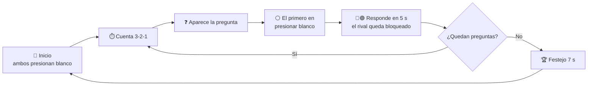

<div align="center">

# 🧉 QUIZ de cultura Santiagueña

### Un juego de preguntas para dos jugadores, con controles arcade hechos a mano


</div>

---

## 🎯 ¿De qué se trata?

Dos jugadores, cada uno con **tres botones arcade**, compiten por responder preguntas de **cultura santiagueña y cultura general**. El primero que presiona el **botón blanco** gana el turno, y su rival queda bloqueado mientras responde con el **azul** o el **verde**.

Gana quien acierte más respuestas en la ronda de **5 preguntas**.

> Pensado como juego didáctico para chicos de **6 a 12 años**.

---

## 🕹️ Cómo se juega



1. **Pantalla inicial:** cada jugador presiona su botón blanco una vez. El juego muestra quién ya está listo y espera al otro.
2. **Cuenta regresiva** de 3 segundos antes de cada pregunta.
3. **Se lee la pregunta.** El primero en presionar el **botón blanco** gana el turno.
4. **Responde en 5 segundos** con **azul** (izquierda) o **verde** (derecha). Si acierta, suma 1 punto.
5. Después de **5 preguntas** gana quien tenga más puntos. Si hay **empate**, siguen preguntas de desempate.
6. **Pantalla de festejo** durante 7 segundos y vuelta automática al inicio.

### ⏲️ Reglas de tiempo

| Situación | Qué pasa |
|---|---|
| Nadie presiona blanco en **20 s** | Se saltea la pregunta, nadie suma |
| El jugador no responde en **5 s** | No suma punto y sigue la partida |
| Empate tras 5 preguntas | Preguntas de desempate hasta que alguien gane |
| Pantalla de festejo | Dura 7 s, o se reinicia antes con el botón blanco |

---

## 🎮 Controles

Cada botón de la Pico se comporta como una tecla del teclado:

| Color | 👤 Jugador 1 | 👤 Jugador 2 |
|:---:|:---:|:---:|
| 🔵 Azul | `A` | `J` |
| 🟢 Verde | `S` | `K` |
| ⚪ Blanco | `D` | `L` |

---

## 🧰 Qué necesitás

**Hardware**
- 1 × Raspberry Pi Pico 2W
- 6 × botones arcade (microswitch)
- Base de madera perforada y cables
- Cable USB

**Software**
- [Go](https://go.dev/dl/) y [TinyGo](https://tinygo.org/getting-started/) (para cargar el firmware en la Pico)
- Un navegador moderno (Chrome, Edge o Firefox)

---

## 🔌 Conexión de los botones

No hacen falta resistencias: se usan las **pull-ups internas** de la Pico.
Un terminal de cada botón va a su GPIO y el otro terminal va a **GND** (los seis pueden compartir GND).

| Botón | GPIO | Tecla |
|---|:---:|:---:|
| J1 · 🔵 Azul | GP2 | `A` |
| J1 · 🟢 Verde | GP3 | `S` |
| J1 · ⚪ Blanco | GP4 | `D` |
| J2 · 🔵 Azul | GP6 | `J` |
| J2 · 🟢 Verde | GP7 | `K` |
| J2 · ⚪ Blanco | GP8 | `L` |

> 💡 La placa original (Makey Makey) no permitía presionar más de dos botones a la vez. Con la Pico, cada botón se lee de forma independiente y los seis pueden funcionar en simultáneo.

---

## ⚙️ Firmware de la Pico (TinyGo)

Guardá este código como `firmware/main.go`. La Pico se presenta como **teclado USB** y enciende el **LED integrado** mientras haya algún botón presionado.

LINK

### Cargarlo en la placa

```bash
cd firmware
go mod init botones
go get github.com/soypat/cyw43439
tinygo flash -target=pico2-w -stack-size=8kb -scheduler=tasks .
```

- **Primera vez:** desconectá la Pico, mantené apretado **BOOTSEL** mientras la conectás por USB y soltá. Aparece como una unidad de disco.
- **Cargas siguientes:** normalmente alcanza con tenerla conectada y repetir el comando.
- **Linux:** si da error de permisos, agregá tu usuario al grupo `dialout`.

---

## 🚀 Cómo jugar

1. Cargá el firmware en la Pico y conectala a la compu por USB.
2. Abrí `index.html` en el navegador (doble clic).
3. Hacé clic una vez en la página para que el navegador permita el sonido.
4. Cada jugador presiona su **botón blanco** y ¡a jugar!

---

## 📁 Estructura del proyecto

```
quiz-santiagueno/
├── index.html      ← estructura de la página
├── style.css       ← aspecto: colores, tamaños, animaciones
├── script.js       ← lógica del juego
├── preguntas.js    ← (opcional) banco de preguntas separado
└── img/
  └── bandera.png     ← (opcional) fondo de la pantalla inicial
└── firmware/
    └── fw-control-pico2w-led/
        └── main.go     ← código TinyGo para la Pico 2W
```

Cada archivo está **comentado por módulos** para que sea fácil de leer y modificar.

---

## ✏️ Personalizar el juego

| Quiero cambiar... | Dónde |
|---|---|
| Las **preguntas** | Arreglo `Q` (módulo 1 de `script.js`, o `preguntas.js` si lo separaste) |
| Las **teclas** | Objeto `MAP` (módulo 2 de `script.js`) y las teclas del firmware |
| Los **colores** | Variables `:root` (sección 1 de `style.css`) |
| El **tiempo de respuesta** (5 s) | `buzz()` en `script.js` y la duración de `.bar i` en `style.css` |
| El **tiempo de espera** (20 s) | `showQ()` en `script.js` |
| La **cantidad de preguntas** (5) | La condición `n>=5` en `next()` y el texto `/ 5` en `hud()` |

### ➕ Agregar una pregunta

Cada pregunta es una línea con tres textos: **pregunta, respuesta correcta, respuesta incorrecta**. El juego mezcla las respuestas, así que la correcta no cae siempre del mismo lado.

```js
["¿Qué instrumento no puede faltar en una chacarera?","Bombo legüero","Trompeta"],
```

---

## 🛠️ Solución de problemas

| Problema | Posible solución |
|---|---|
| Los botones no responden | Hacé clic en la página para darle foco y revisá que la Pico esté conectada |
| No suena nada | El navegador exige una interacción previa: hacé clic o presioná un botón y reintentá |
| `tinygo flash` no encuentra la placa | Usá el modo **BOOTSEL** (ver arriba) |
| El LED tarda en responder | Es normal: el chip WiFi se inicializa al arrancar y demora un segundo |
| Error de `Q is not defined` | `preguntas.js` debe cargarse **antes** que `script.js` en `index.html` |
| La imagen de fondo no aparece | Revisá que el nombre y la extensión coincidan exactamente y que esté en la misma carpeta |

---

## 🗺️ Ideas para seguir

- [ ] Niveles de dificultad por edad (6-8 y 9-12)
- [ ] Más minijuegos: Simon, carrera de cálculo mental, reflejos
- [ ] Más preguntas, con imágenes
- [ ] Bandera de Santiago del Estero como fondo de la pantalla inicial
- [ ] Modo cooperativo

---

<div align="center">

Hecho con 💙 y 💚 en **Santiago del Estero**, la *Madre de Ciudades* 🧉

</div>
